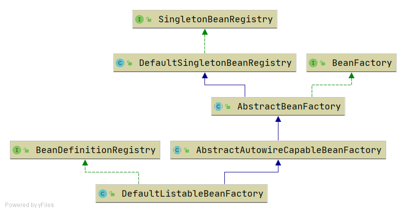
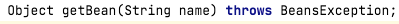
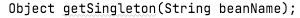
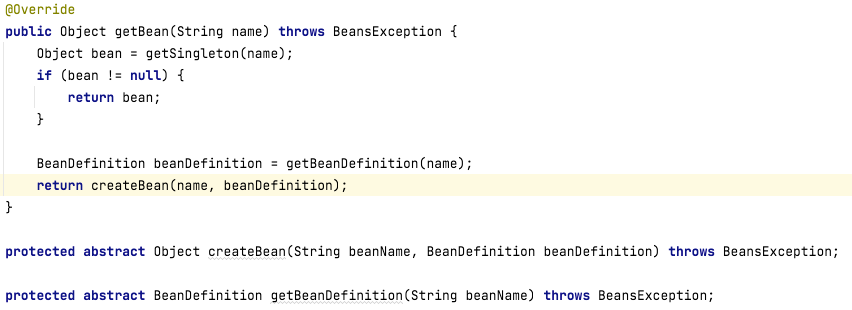
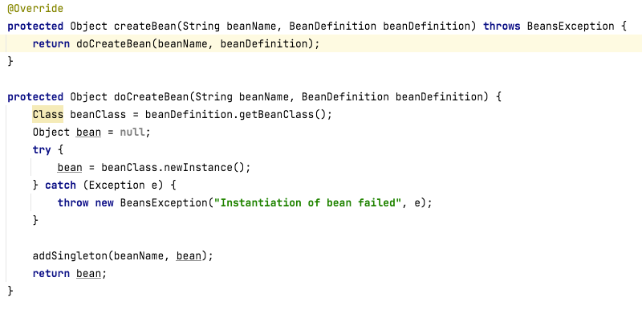
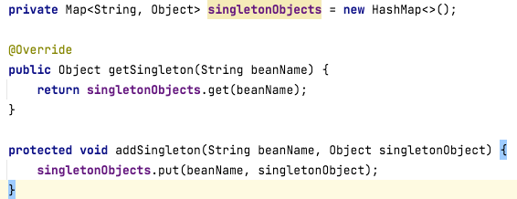
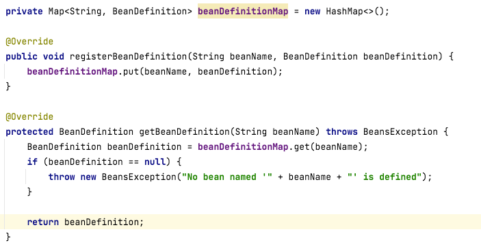

# 类图


## 1、接口
### 1、1 ```BeanFactory```

### 1、2 ```BeanDefinitionRegistry```

### 1、3 ```SingletonBeanRegistry```


## 2、抽象类
### 2、1 ```AbstractBeanFactory```

### 2、2 ```AbstractAutowireCapableBeanFactory```


## 3、类
### 3、1 ```DefaultSingletonBeanRegistry```

### 3、2 ```DefaultListableBeanRegistry```
